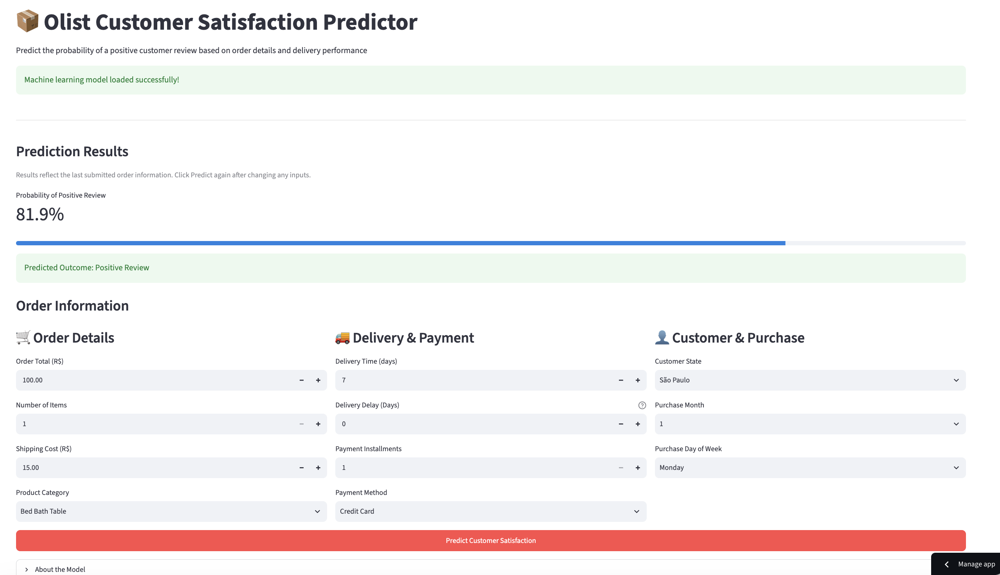
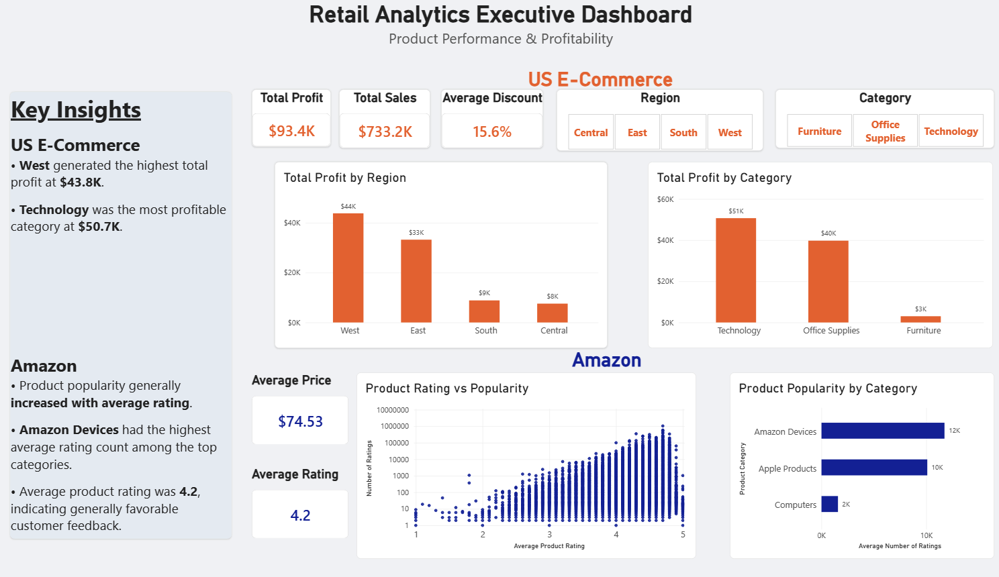
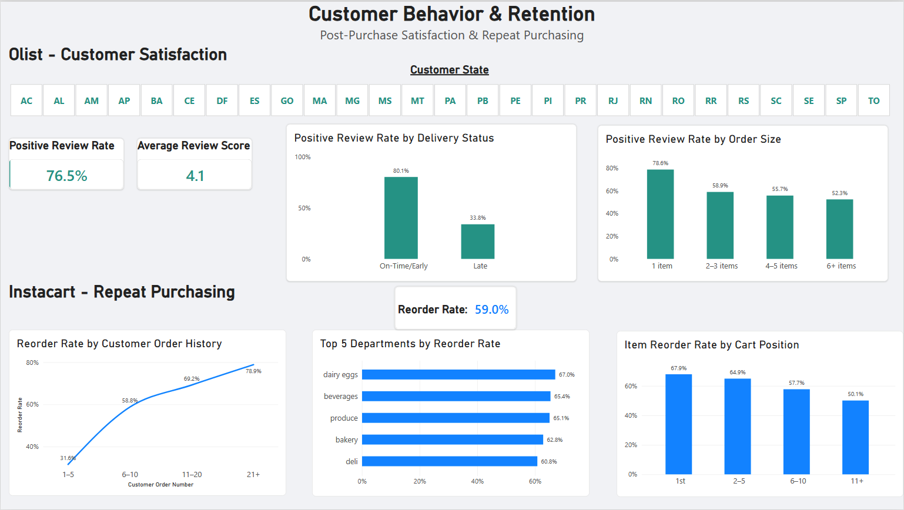

# Retail Analytics Capstone

An end-to-end retail analytics project integrating **machine learning, cloud data engineering, SQL, business intelligence, and model deployment** across four e-commerce datasets.

The project examines four stages of the retail lifecycle:

- **Amazon Reviews 2023:** Product popularity and demand
- **Instacart Market Basket Analysis:** Repeat purchasing behavior
- **US E-Commerce 2020:** Order profitability
- **Olist E-Commerce:** Post-purchase customer satisfaction

The project combines Python-based exploratory analysis and machine learning with an Azure data pipeline, curated SQL views, interactive Power BI dashboards, and a deployed Streamlit prediction application.

## Live Machine Learning Application

### Olist Customer Satisfaction Predictor

**[Launch Interactive Streamlit App](https://olist-satisfaction-predictor.streamlit.app/)** (best in Google Chrome)



A deployed machine learning application that estimates the probability of a positive customer review based on order characteristics, delivery performance, payment information, and customer location.

Users can adjust 11 input features and generate predictions through an interactive interface.

**Application details:**
- **Model:** HistGradientBoostingClassifier
- **Test ROC-AUC:** 0.706
- **Test Accuracy:** 82.3%
- **Test F1 Score:** 0.897
- **Framework:** Streamlit
- **Deployment:** Streamlit Community Cloud

The application loads a saved scikit-learn pipeline containing both preprocessing and the trained classification model, allowing predictions without retraining.

Because the model uses actual delivery information, predictions apply to **post-delivery customer satisfaction** rather than pre-purchase outcomes.

[View Application Source Code](streamlit_app/)

## Project Architecture

The project integrates cloud data engineering, business intelligence, and machine learning into two complementary analytical workflows.

**Cloud Analytics Pipeline**

```text
Raw Retail Data
       ↓
Azure Blob Storage
       ↓
Azure Data Factory
       ↓
Processed Parquet
       ↓
Azure Synapse Serverless SQL
       ↓
Curated Analytics Views
       ↓
Power BI Dashboards
```

**Machine Learning Workflow**

```text
Python / pandas
       ↓
Exploratory Data Analysis
       ↓
Feature Engineering
       ↓
Model Training & Evaluation
       ↓
Saved Scikit-learn Pipeline
       ↓
Streamlit Application
       ↓
Cloud Deployment
```

The Power BI dashboards support descriptive business analytics, while the Streamlit application provides an interactive interface for individual customer satisfaction predictions.

## Power BI Dashboards

Two interactive dashboard pages were developed using curated Azure Synapse SQL views.

### 1. Product Performance & Profitability

Analyzes US E-Commerce profitability and Amazon product performance.



**Key Insights**

- The **West** generated the highest US E-Commerce total profit at approximately **$43.8K**.
- **Technology** was the most profitable product category at approximately **$50.7K**.
- Higher Amazon product ratings were generally associated with greater product popularity.
- **Amazon Devices** had the highest average rating count among the leading product categories.

### 2. Customer Behavior & Retention

Analyzes Olist customer satisfaction and Instacart repeat purchasing behavior.



**Key Insights**

- On-time/early Olist deliveries had an **80.6% positive-review rate**, compared with **34.6% for late deliveries**.
- Positive-review rates generally declined as order size increased.
- Instacart reorder rates increased from approximately **31.6% for customer orders 1–5** to **78.9% for orders 21+**.
- Products added earlier in the shopping cart had higher reorder rates.
- Dairy & Eggs, Beverages, and Produce were among the departments with the highest reorder rates.

**Dashboard Features**
- Interactive slicers for region, product category, and customer state
- KPI cards displaying profitability, product ratings, satisfaction, and reorder behavior
- DAX measures and calculated columns
- Cross-filtering and interactive visualizations
- Direct integration with curated Azure Synapse SQL views through Power BI Import mode

See [Power BI Documentation](powerbi/README.md) for additional details.

## Machine Learning Results

Multiple supervised and unsupervised learning algorithms were evaluated across the four datasets, including:

- Logistic and Linear Regression
- K-Nearest Neighbors
- Support Vector Machines
- Decision Trees and Random Forests
- Gradient Boosting
- K-Means Clustering
- Hierarchical Agglomerative Clustering
- DBSCAN

### Selected Model Performance

| Dataset | Business Problem | Model | Performance |
|---|---|---|---|
| Amazon | Product Popularity | Random Forest | ROC-AUC: **0.694** |
| Amazon | Rating Count Regression | Gradient Boosting | R²: **0.227** |
| Instacart | Product Reordering | Random Forest | ROC-AUC: **0.631** |
| US E-Commerce | Profitability Classification | Logistic Regression | ROC-AUC: **0.943** |
| US E-Commerce | Profit Regression | Random Forest | R²: **0.73** |
| Olist | Customer Satisfaction | HistGradientBoosting | ROC-AUC: **0.706** |

### Amazon — Product Popularity

The Amazon analysis examined whether product characteristics could explain and predict popularity.

- Average product rating was the dominant Random Forest feature, accounting for approximately **88% of feature importance**.
- Gradient Boosting improved rating-count regression performance to **R² = 0.227**, compared with **R² = 0.114** for Linear Regression.
- Clustering identified groups of products based on rating, price, and customer engagement characteristics.

These findings suggest that product popularity contains meaningful nonlinear relationships and that customer rating information is particularly informative.

### Instacart — Repeat Purchasing

The Instacart analysis examined whether product and order characteristics could predict reordering behavior.

- Random Forest achieved approximately **0.631 ROC-AUC**.
- Reordering was the most difficult of the four classification problems.
- Descriptive analysis identified higher reorder rates among customers with more extensive purchase histories.
- Products added earlier in shopping carts were more frequently reordered.

The results suggest that additional customer-level behavioral information may improve reorder prediction.

### US E-Commerce — Profitability

The US E-Commerce analysis examined order profitability and geographic purchasing patterns.

- Logistic Regression achieved approximately **0.943 ROC-AUC** for profitability classification.
- Approximately **81% of observations were profitable**, providing important context for interpreting classification performance.
- Random Forest achieved approximately **R² = 0.73** for profit regression, compared with approximately **R² = 0.22** for Linear Regression.
- Regional and category-level analysis revealed substantial differences in total profitability.

The improvement from Linear Regression to Random Forest suggests that nonlinear relationships are important for predicting profit.

### Olist — Customer Satisfaction

The Olist analysis examined whether order, delivery, payment, product, and geographic characteristics could predict positive customer reviews.

- HistGradientBoosting achieved approximately **0.706 ROC-AUC**.
- Delivery time and number of items were among the most informative predictive features.
- On-time delivery was strongly associated with positive customer reviews.
- Larger orders generally exhibited lower positive-review rates.
- Geographic differences were observed, although delivery performance was more informative for individual-level prediction.

The trained HistGradientBoosting pipeline was subsequently deployed through Streamlit.

## Azure Data Engineering

The cloud data-engineering workflow ingests and standardizes retail data for downstream SQL analysis and business intelligence.

### Data Ingestion

- Preserved original source files in **Azure Blob Storage**.
- Used **Azure Data Factory** to orchestrate ingestion and conversion.
- Implemented parameterized datasets and **ForEach** activities for reusable multi-file processing.
- Converted Olist and Instacart CSV source files into Parquet.
- Converted US E-Commerce CSV data into Parquet with standardized column names.
- Retained Amazon source files in their existing Parquet format to avoid unnecessary processing.
- Used Managed Identity and RBAC for secure Azure resource access.

### Pipeline Features

- Raw and processed storage layers
- Parameterized source and sink datasets
- Dynamic content and reusable pipeline activities
- CSV-to-Parquet conversion
- Schema standardization
- Managed Identity authentication
- Pipeline validation and debugging

See [Azure Pipeline Documentation](azure/README.md) for implementation details.

## Synapse SQL Analytics Layer

**Azure Synapse Serverless SQL** provides the analytical layer between cloud storage and Power BI.

The SQL workflow includes:

- Querying external Parquet files using `OPENROWSET`
- Standardizing data types using `CAST` and `TRY_CAST`
- Joining relational datasets across Olist and Instacart
- Aggregating records to appropriate analytical grains
- Creating reusable curated views
- Executing business queries for profitability, popularity, satisfaction, and reordering

### Curated Views

| View | Analytical Grain | Primary Purpose |
|---|---|---|
| `vw_curated_amazon` | Product | Product popularity and ratings |
| `vw_curated_instacart` | Product within an order | Repeat purchasing behavior |
| `vw_curated_olist` | Order | Customer satisfaction and delivery |
| `vw_curated_us_ecommerce` | Transaction record | Profitability and sales |

These views provide standardized data for Power BI reporting.

See the [SQL Scripts](sql/) for implementation details.

## Cross-Dataset Insights

Several broader findings emerged across the retail lifecycle:

- **Different retail problems required different predictors and models.** No single algorithm or feature set performed best across popularity, reordering, profitability, and satisfaction.

- **Nonlinear relationships were common.** Tree-based and boosting models frequently improved upon linear baselines.

- **Historical purchasing behavior was associated with repeat purchasing.** Instacart reorder rates increased substantially with customer order history.

- **Profitability varied by category and geography.** US E-Commerce analysis identified Technology and the West as leading contributors to total profit.

- **Fulfillment performance was strongly associated with satisfaction.** Olist orders delivered on time had substantially higher positive-review rates.

Overall, the project demonstrates how data science, cloud engineering, and business intelligence can support decisions across merchandising, customer retention, pricing, and fulfillment.

## Technology Stack

### Data Science & Machine Learning
- Python
- pandas / NumPy
- scikit-learn
- Matplotlib / Seaborn
- Jupyter Notebooks

### Cloud & Data Engineering
- Azure Blob Storage
- Azure Data Factory
- Azure Synapse Serverless SQL
- Parquet
- SQL

### Business Intelligence
- Power BI
- DAX
- Power Query

### Application Development & Deployment
- Streamlit
- joblib
- Streamlit Community Cloud

### Version Control & Development
- Git
- GitHub
- VS Code

## Repository Structure

```text
retail-analytics-capstone/
├── amazon/
│   └── amazon_analysis.ipynb
├── instacart/
│   └── instacart_analysis.ipynb
├── us_ecommerce/
│   └── us_ecommerce_analysis.ipynb
├── olist/
│   └── Olist_dataset.ipynb
├── azure/
│   └── README.md
├── sql/
│   ├── 01_setup.sql
│   ├── 02_1_us_ecommerce_views.sql
│   ├── 02_2_us_ecommerce_business_queries.sql
│   ├── 03_1_olist_views_joins.sql
│   ├── 03_2_olist_feature_engineering.sql
│   ├── 03_3_olist_business_queries.sql
│   ├── 04_1_instacart_views_joins.sql
│   ├── 04_2_instacart_business_queries.sql
│   ├── 05_1_amazon_views_joins.sql
│   └── 05_2_amazon_business_queries.sql
├── powerbi/
│   ├── README.md
│   └── images/
│       ├── main_product_performance_dashboard.png
│       └── customer_behavior_dashboard.png
├── streamlit_app/
│   ├── app.py
│   ├── olist_satisfaction_model.joblib
│   └── requirements.txt
├── .gitignore
└── README.md
```

## Project Status

- [x] Exploratory data analysis
- [x] Feature engineering
- [x] Machine learning and model evaluation
- [x] Azure data ingestion pipeline
- [x] Synapse Serverless SQL analytics layer
- [x] Interactive Power BI dashboards
- [x] Streamlit machine learning application
- [x] Cloud deployment

**[Try the Live Olist Satisfaction Predictor](https://olist-satisfaction-predictor.streamlit.app/)**
